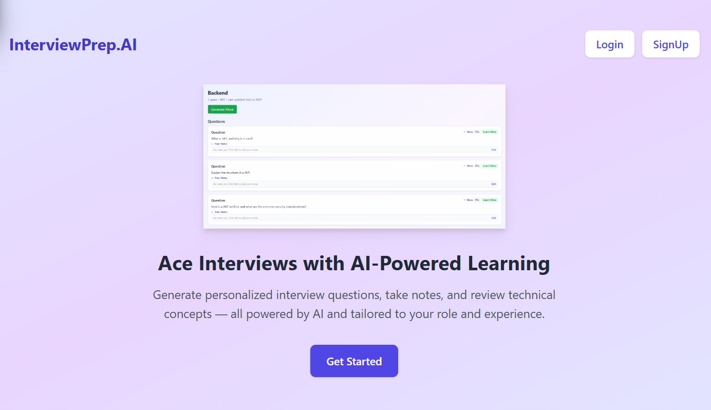
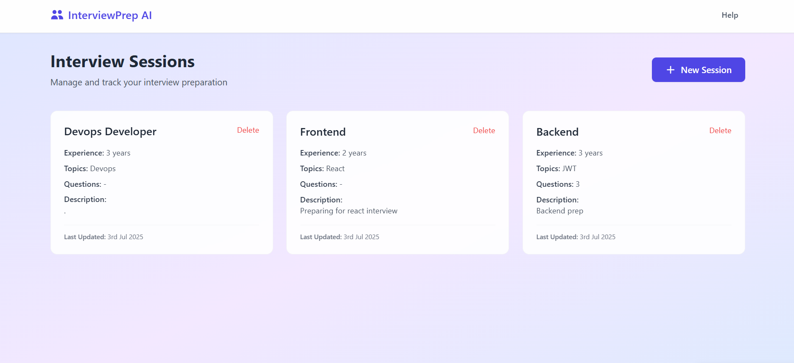

# InterviewPrep.AI

**Ace Interviews with AI-Powered Learning**

🚀 InterviewPrep.AI is a full-stack MERN application that helps users prepare for technical interviews with personalized, AI-generated questions and concept explanations — tailored to their role and experience.

---

## 🧠 Features

- ✨ AI-generated interview questions
- 📚 Learn concepts with AI-powered explanations
- 📝 Add personal notes to each question
- 📌 Pin important questions for quick access
- 🔁 Regenerate more questions instantly
- 🗂️ Manage multiple interview prep sessions
- 🔐 Login/Signup with authentication

---

## 📸 Preview

### 🏠 Landing Page

> Clean homepage with a quick overview and call-to-action for users.

---

### 📅 Dashboard - Interview Sessions

> View and manage your sessions with role, experience, and topic-specific cards.

---

### 📋 Session Detail Page

> View questions, pin them, add notes, and learn more using AI.

---

## 🛠️ Tech Stack

**Frontend**
- React + Vite
- Tailwind CSS
- Axios
- Lucide Icons

**Backend**
- Node.js + Express
- MongoDB + Mongoose
- Google Gemini API (AI)
- JWT Authentication

---

## 📁 Folder Structure

client/
├── components/
├── pages/
├── context/
├── utils/

server/
├── controllers/
├── models/
├── routes/
├── utils/
├── config/

---

## 🔐 Authentication

- User signup and login using hashed passwords (`bcryptjs`)
- JWT-based auth and protected routes
- Stores token in `localStorage` and sets auth headers with Axios

---

## 🤖 AI Integration

Uses Google Gemini AI to:
- Generate smart, contextual interview questions
- Explain technical topics clearly and concisely

---
